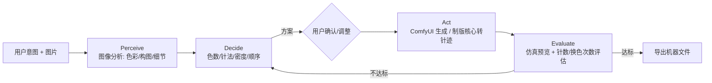

# 制版 Agent 设计

## 定位
替代人工制版师的核心决策环节：看图 → 定方案 → 生成 → 评估 → 导出。

## 运行模式

## 工具集（Tools）
| 工具 | 实现 |
|---|---|
| analyze_image | sidecar digitizer.pipeline（量化/连通域/几何特征） |
| comfyui_workflow | 经主进程 ComfyUI Connector 提交工作流 |
| region_repaint | 选区 + inpaint 局部重绘 |
| stitch_simulate | 针迹仿真渲染，估算针数/线长 |
| export_file | pyembroidery 导出 DST/PES/JEF |

## 推理后端
- 默认：本地 GGUF 小模型（llama.cpp，models/gguf），可离线
- 可选：OpenAI 兼容端点（设置页配置 base_url + key）
- MVP 阶段：规则式决策（已实现），LLM 逐步接管开放式意图理解

## 数据闭环
用户确认的方案 + 导出结果回写 `datasets/stitch_pairs/`，
用于微调 LoRA（风格）与评估制版策略（针数/换色次数最优）。
