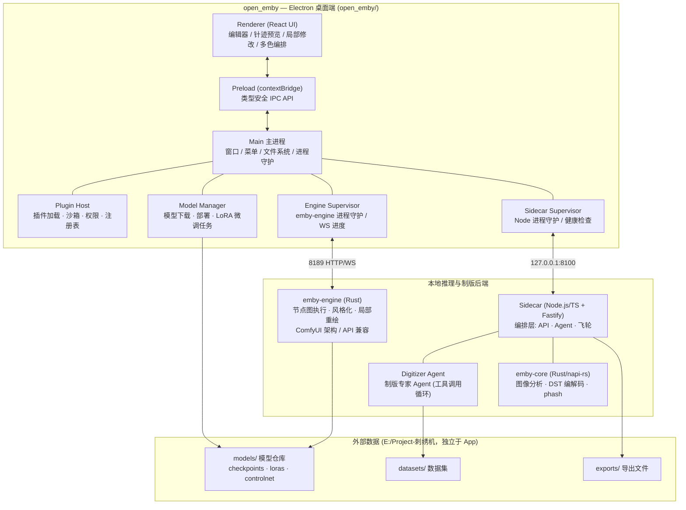
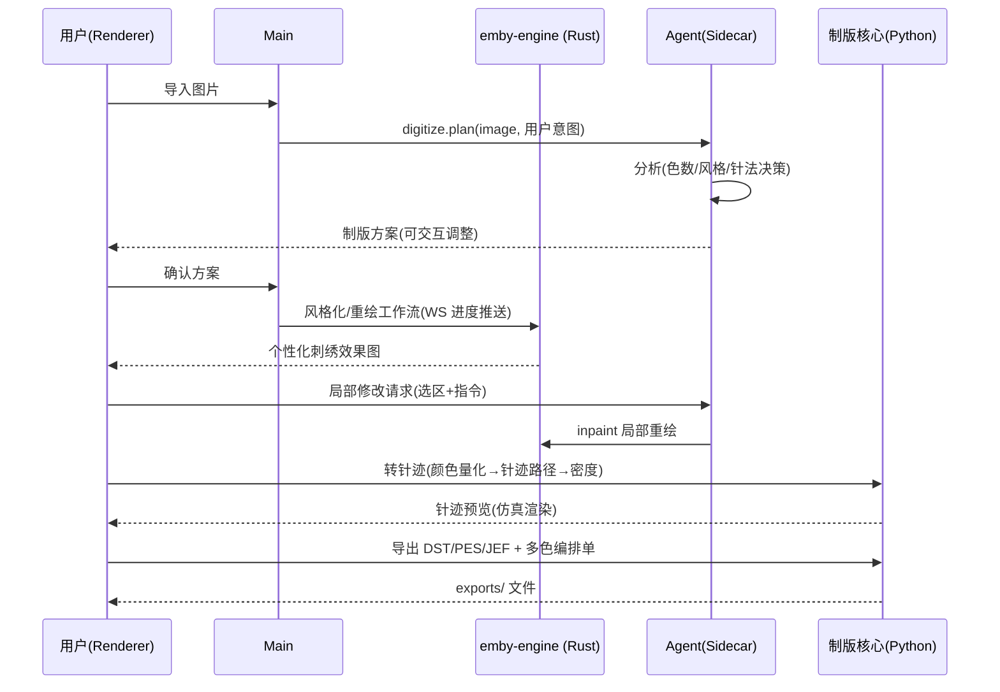

# open_emby 总体架构设计

> AI 刺绣制版软件：任意图片 → 个性化刺绣图稿 → 局部修改 → 刺绣机文件（DST/PES/JEF）→ 多色编排。
> 面向插件化与社区开放贡献，内置专业刺绣制版 Agent，支持部署与微调开源小模型。

---

## 1. 系统分层总览



## 2. 目录结构

```
E:\Project-刺绣机\                  # 工作区根（数据与代码分离）
├── open_emby\                     # Electron 应用（本仓库）
│   ├── docs\                      # 架构 / 插件规范 / Agent 设计
│   ├── src\
│   │   ├── main\                  # Electron 主进程
│   │   │   ├── index.ts
│   │   │   ├── services\         # comfyui / models / sidecar / plugins
│   │   │   └── ipc\              # IPC handler 注册
│   │   ├── preload\              # contextBridge 桥
│   │   ├── renderer\             # React 前端
│   │   │   └── src\{pages,components,stores,api}
│   │   └── shared\               # 主/渲染进程共享类型与 IPC 通道常量
│   ├── plugins\                  # 内置插件 + 插件 schema
│   ├── sidecar\                  # TS 编排层 (Fastify): API/Agent/飞轮
│   ├── crates\emby-core\        # Rust 原生核心 (napi-rs): 图像/编解码/phash
│   ├── assets\
│   ├── electron.vite.config.ts
│   └── package.json
├── datasets\                     # 外部数据集（训练/微调用）
│   ├── raw\                      # 原始图片
│   ├── processed\                # 预处理后（512/1024 + caption）
│   └── stitch_pairs\             # 图稿↔针迹配对数据
├── models\                       # 模型仓库
│   ├── checkpoints\ loras\ controlnet\ gguf\
└── exports\                      # 导出的刺绣机文件
```

## 3. 核心数据流（图片 → 刺绣机文件）



## 4. 模块设计要点

### 4.1 Electron 主进程服务 (src/main/services)
| 服务 | 职责 |
|---|---|
| `engine.ts` | 拉起/守护 emby-engine（crates/emby-engine，默认 127.0.0.1:8189），提交工作流 JSON、WebSocket 节点级进度、结果取回 |
| `modelManager.ts` | 从 HuggingFace 下载 checkpoint/LoRA 到 `models/`，注册给 emby-engine（candle 后端落地后直读 safetensors）；微调任务（kohya sd-scripts 等，隔离工具链）队列管理 |
| `pythonSidecar.ts` | spawn/守护 Python FastAPI sidecar，健康检查，端口协商，日志回传 |
| `pluginHost.ts` | 扫描 `plugins/` 与用户插件目录，校验 manifest，按权限加载，生命周期管理 |

### 4.2 Sidecar（sidecar/，TS 编排层）与 emby-core（Rust 计算层）
- **职责切分**：UI 与生态编排 = Electron/Node；性能密集计算（编解码、加解密、图像处理、文件索引）= Rust（napi-rs 原生模块 `crates/emby-core`）；**图像生成 = Rust 原生引擎 `crates/emby-engine`**（借鉴 ComfyUI 后端架构：节点注册表 + 拓扑执行 + 队列 + WS 进度，API 与 ComfyUI 兼容，详见 [ENGINE.md](ENGINE.html)）。
- **sidecar**：Fastify 单进程，仅监听 127.0.0.1，Electron 启动时拉起（tsx 直跑 TS，生产改 esbuild bundle）。
- **emby-core（已实现）**：`analyze_image`（Lab KMeans 量化 + 连通域 + 针法启发）、`dst_encode`（Tajima DST 二进制编码）、`phash`（感知哈希去重）、`save_resized_png`（训练集预处理）。
- **制版流水线 digitizer**：图像分割 → 颜色量化（限色到线色数）→ 针法分配（平针/缎面/榻榻米/轮廓）→ 密度与方向 → 针迹路径生成（`crates/emby-core/stitch.rs`：Lab KMeans + 背景识别 + 蛇形扫描线填针，输出 mm 绝对坐标针迹序列）。
- **导出 exporters**：DST（Rust 编码器，自研替代 pyembroidery）消费真实针迹序列；PES/JEF/EXP 编解码器按同模式在 emby-core 扩展。
- **Agent**：工具调用循环（本地小模型 GGUF via llama.cpp，或远程 API），工具 = {图像分析, emby-engine 工作流, 制版参数, 导出}，产出可解释的制版方案。
- **例外**：模型微调执行器（kohya sd-scripts 等）允许使用 Python，但隔离在独立训练工具链中，不属于产品运行时。

### 4.3 插件系统
- manifest（plugin.json）+ 入口模块，类型：`workflow`（emby-engine 工作流包，ComfyUI API 格式）、`exporter`（新机器格式）、`tool`（编辑器工具）、`agent-skill`（Agent 能力）、`theme`。
- 渲染侧插件运行在隔离 iframe / 受限 API；主进程侧插件声明权限（fs/net/child_process）逐项授权。
- 社区贡献：plugins/community 以 git submodule / PR 方式收录，CI 校验 schema。

### 4.4 模型与微调
- 小模型优先：SD1.5/SD-Turbo 类 checkpoint + LoRA 微调刺绣风格；GGUF 小 LLM（Qwen 级）驱动 Agent。
- 数据集在 `E:/Project-刺绣机/datasets`，训练脚本读取该目录，产物 LoRA 写回 `models/loras`，Model Manager 注册后 emby-engine 立即可用。
- **模型谱系命名**：`emby-<代数>-<代号>`（天体系列）——emby-1-luna（首代风格化）→ emby-1.1-sol → emby-2-terra…；权威清单见 `src/shared/modelLineup.ts`，插件市场模型包须遵循该命名。

## 5. 技术选型

| 层 | 选型 | 理由 |
|---|---|---|
| 桌面壳 | Electron + electron-vite + React + TypeScript | 生态最大、社区贡献门槛低、与 ComfyUI 桌面版同栈 |
| 状态管理 | zustand | 轻量，编辑器友好 |
| 针迹预览 | Canvas2D 起步，预留 WebGL(pixi.js) | 10万针级渲染 |
| 生成引擎 | Rust (axum) — crates/emby-engine，ComfyUI 架构/API 兼容 | 安全高效、单二进制分发、无 Python 依赖 |
| 制版核心 | TS 编排 (Fastify) + Rust 计算 (napi-rs: 自研 DST 编码/图像分析) | 无 Python 运行时依赖，随 App 分发 |
| Agent | 工具调用循环 + 本地 GGUF / 可切换 OpenAI 兼容端点 | 可离线 |
| 打包 | electron-builder (NSIS) | 一键安装包 |

## 6. 环境约定
- 生成引擎 emby-engine: `crates/emby-engine`（Rust 二进制，随 App 拉起），API 默认 `http://127.0.0.1:8189`
- Sidecar: `http://127.0.0.1:8100`（Node.js + Rust 原生模块）
- 外部数据根: `E:\Project-刺绣机`（由设置页可改，存 userData/settings.json）
- Node ≥ 20，pnpm ≥ 9，Rust ≥ 1.75（cargo，构建 emby-core）；运行时**无 Python 依赖**；一键安装 `pnpm run setup`
