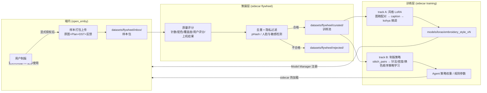
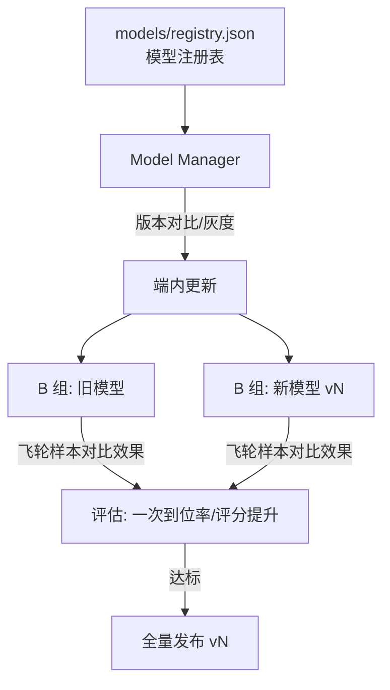

# 数据飞轮机制设计（Data Flywheel）

> 用户授权上传「原图 + 制版结果 + 使用反馈」→ 质量筛选入训练池 → 训练/微调专家模型 → 新模型回流端内。
> 目标：让制版 Agent 与刺绣风格模型随社区使用持续进化。

## 1. 飞轮闭环



## 2. 样本包格式（Sample Package）

每次导出一个机器文件时，若用户已授权，自动生成一个样本包：

```
datasets/flywheel/inbox/<sample_id>/
├── sample.json        # 清单（见下）
├── original.png       # 原图
├── artwork.png        # 最终效果图稿（风格化+局部修改后）
├── preview.png        # 针迹仿真预览
├── design.dst         # 导出结果（pes/jef 同理）
└── plan.json          # DigitizePlan 快照
```

`sample.json`：
```json
{
  "sample_id": "uuid4",
  "created_at": "ISO8601",
  "contributor_id": "匿名ID(本机生成，非账号)",
  "app_version": "0.1.0",
  "consent": { "scope": "anonymous_training", "granted_at": "ISO8601" },
  "machine": { "format": "dst", "size_mm": [100, 100], "stitch_count": 12340, "color_changes": 5 },
  "feedback": {
    "rating": 4,                    // 用户 1-5 星（可选）
    "edit_rounds": 2,               // 局部修改轮数（越少=一次到位越好）
    "machine_run": "success",       // success / failed / unknown
    "failure_reason": null
  },
  "phash": "感知哈希(去重用)",
  "tags": ["cartoon", "pet"]
}
```

## 3. 授权与隐私（Consent）

- **默认关闭**。设置页独立开关：`contribution.enabled`，附明确说明文案。
- 三级授权范围：
  | scope | 内容 |
  |---|---|
  | `off` | 不上传任何数据（默认） |
  | `local_only` | 样本只存本机 inbox，供自己微调，不上报 |
  | `anonymous_training` | 匿名化后进入社区训练池 |
- 匿名化：contributor_id 为本机随机 UUID（非账号、不可关联）；导出时剥离 EXIF；人脸/敏感内容检测命中则禁止入池（reject）。
- 用户可随时删除自己的样本（按 contributor_id 过滤删除）。

## 4. 质量评分（quality.py）

`score = 0.35×机器结果 + 0.25×用户评分 + 0.20×工艺合理性 + 0.20×一次到位率`

| 信号 | 来源 | 说明 |
|---|---|---|
| machine_run | 反馈 | success=1.0 / unknown=0.5 / failed=0 |
| rating | 反馈 | 1-5 星归一化 |
| 工艺合理性 | 静态分析 | 针数/面积密度是否越界、换色次数是否过多、跳跃针比例 |
| 一次到位率 | edit_rounds | 1/(1+rounds) |

阈值：`≥0.7 进 curated`，`0.4-0.7 待人工复核`（MVP 先自动进 curated 但标记 low_confidence），`<0.4 进 rejected`。

## 5. 训练双轨

### Track A — 刺绣风格 LoRA（图像生成侧）
- 输入：curated 中 (original→artwork) 配对 + tags
- 预处理：`sidecar/src/training/prepare.ts`（编排）+ Rust `save_resized_png`（图像处理） → 统一 512/1024 + caption（"embroidery, <tags>, <style>"）→ `datasets/processed/`
- 训练：kohya sd-scripts / ComfyUI LoRA 节点 → `models/loras/embroidery_style_vN.safetensors`（微调执行器是唯一允许的 Python 环节，独立工具链隔离，非产品运行时）
- 注册：Model Manager 记录版本、样本数、基座模型、评估指标

### Track B — 制版策略优化（Agent 决策侧）
- 输入：curated 中 plan.json + feedback（什么样的图 → 什么参数 → 好结果）
- 方式（由浅入深）：
  1. **MVP：统计规则调参** — 按图像特征聚类，学习每类的最优 (色数/密度/针法) 分布
  2. **轻量模型** — 图像 embedding → 回归制版参数（小 MLP，可端内推理）
  3. **DPO/偏好微调** — 用 rating + edit_rounds 构造偏好对，微调 Agent LLM 的方案生成能力

## 6. 模型版本与回流



`models/registry.json` 记录：版本号、基座、训练样本数、score 分布、灰度比例、发布状态。
社区模型同样走 registry + 插件通道分发（agent-skill / workflow 类型插件可携带模型引用）。

## 7. API 一览（sidecar）

| 端点 | 说明 |
|---|---|
| `POST /flywheel/contribute` | 提交样本包（端内导出后自动调用，受 consent 控制） |
| `GET /flywheel/samples?pool=inbox\|curated\|rejected` | 列出样本 |
| `POST /flywheel/curate` | 对 inbox 样本跑评分+去重，分流到 curated/rejected |
| `DELETE /flywheel/samples/{contributor_id}` | 删除某贡献者全部样本（隐私权） |
| `POST /training/prepare` | curated → datasets/processed（LoRA 训练格式） |
| `GET /training/stats` | 训练池统计（样本数/评分分布/标签分布） |

## 8. 实施路线
- [x] 样本包格式 + collector + quality + curate 端点（本次）
- [x] consent 设置项 + 匿名 contributor_id（本次）
- [ ] 导出流程自动打包样本（编辑器导出按钮接入）
- [ ] pHash 去重 + 人脸检测（opencv DNN）
- [ ] kohya LoRA 训练任务接入 Model Manager
- [ ] registry.json + 灰度发布